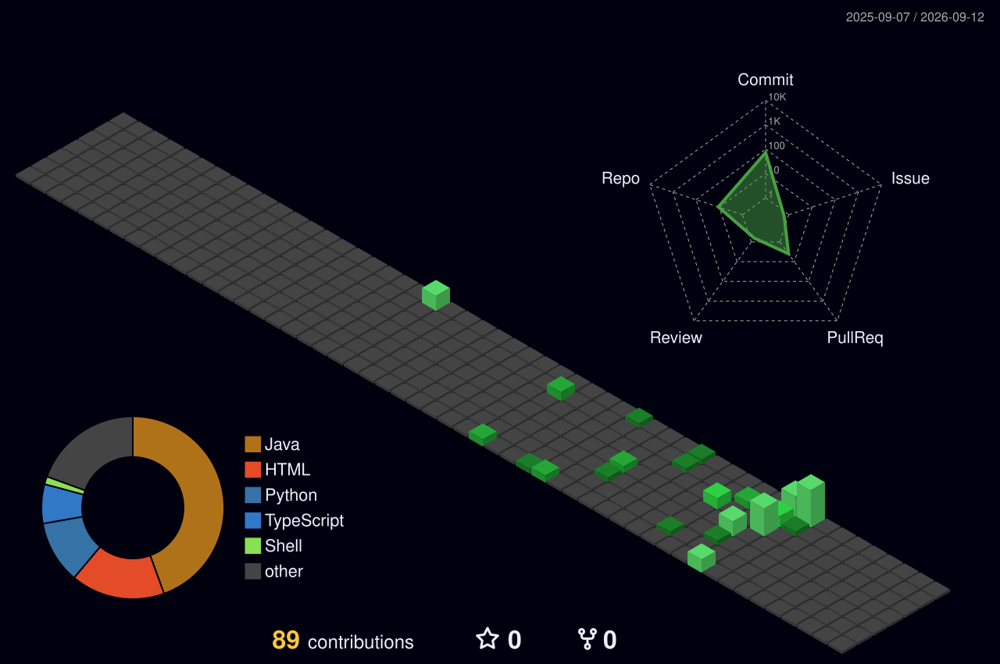

**[LinkedIn](https://www.linkedin.com/in/eranda-vishwa-66a3b1275/)** · **[Portfolio](https://eranda555.github.io)** · **[Email](mailto:erandavishwa555@gmail.com)**

> `network_engineer@eranda:~$` Designing, securing, and optimizing network infrastructure — one packet at a time.

---

## About Me

I'm an ICT undergraduate at the **University of Kelaniya**, specializing in **Computer Systems Networking & Telecommunications**. My passion lies at the intersection of **network engineering** and **cybersecurity** — designing resilient network infrastructures while understanding how to defend them.

Beyond the technical stack, I serve as **Co-Director of Regional Engagement Avenue** at the **Rotaract Club of University of Kelaniya**, where I lead community-driven initiatives that bridge technology with social impact.

I believe in building a strong foundation: mastering how data moves across networks (routing, switching, TCP/IP), securing those pathways (firewalls, monitoring, threat analysis), and automating everything possible (Linux, Bash, scripting). Every project I take on — from enterprise network designs to full-stack applications — reflects this systems-thinking mindset.

---

## Networking & Infrastructure

```yaml
protocols:       [TCP/IP, VLAN, Routing & Switching, DHCP, DNS]
tools:           [Cisco Packet Tracer, VirtualBox]
platforms:       [Linux (Ubuntu)]
administration:  [System Administration, CLI/Bash]
version_control: [Git, GitHub]
cloud:           [Cloud Infrastructure (learning)]
```

## Development & Other Technologies

```yaml
languages:  [Python, TypeScript, Java, HTML, CSS, JavaScript]
frameworks: [React 19, Vite, Streamlit, Tailwind CSS]
libraries:  [Pandas, NumPy, Plotly, yfinance]
tools:      [VS Code, npm]
```

---

## Featured Projects

###  Enterprise Network Design
> **Cisco Packet Tracer** · Network Architecture · VLAN Configuration · Routing Protocols

A multi-site enterprise network design project featuring VLAN segmentation, inter-VLAN routing, OSPF configuration, DHCP server setup, and access control lists. Demonstrates core networking concepts applied to a realistic business topology.  
* Portfolio-based project — not yet published as a standalone repository.

###  Kali Linux Home Lab
> **Cybersecurity** · Kali Linux · VirtualBox · Network Scanning · Security Auditing

A home lab environment built on VirtualBox for hands-on cybersecurity practice. Configured with Kali Linux for network scanning, vulnerability assessment, and security auditing — providing a controlled sandbox for understanding offensive and defensive security techniques.  
* Portfolio-based project — not yet published as a standalone repository.

###  Stock-Scope
> **Python** · **Streamlit** · Pandas · NumPy · Plotly · REST APIs

[View on GitHub](https://github.com/eranda555/Stock-Scope)

A beginner-friendly stock analysis dashboard supporting the **Colombo Stock Exchange (CSE)** and US markets. Features live market status with countdown timers, technical indicators (RSI, MACD, SMA), risk scoring (0–100), scenario-based price projections, and a portfolio allocation simulator. Integrates with the CSE live API and Yahoo Finance with graceful degradation and data freshness indicators.

###  Scientific Calculator
> **TypeScript** · **React 19** · **Vite** · Tailwind CSS

[View on GitHub](https://github.com/eranda555/scientificCalculator)

A feature-rich scientific calculator modeled after Casio-class devices. Supports base-N conversion (HEX/BIN/OCT/DEC), matrix operations, statistics mode, unit conversions, and equation solving. Built with TypeScript, React 19, and Vite for a responsive, modern UI.

---

## Currently Learning

```
├──  Network Design & Routing Protocols (OSPF, EIGRP, BGP)
├──  Cisco Technologies & Packet Tracer (CCNA-level concepts)
├──  Network Troubleshooting & Diagnostics
├──  Cybersecurity Fundamentals & Kali Linux
├──  Linux System Administration (Ubuntu Server)
└──  Cloud Technologies (AWS / Azure fundamentals)
```

---

## Contribution Activity



*Updated daily via GitHub Actions.*


## Let's Connect

I'm always open to discussing network engineering, cybersecurity, or potential collaborations — especially if you're working on something in the Sri Lankan tech space.

<a href="mailto:erandavishwa555@gmail.com"></a>&nbsp;&nbsp;
<a href="https://www.linkedin.com/in/eranda-vishwa-66a3b1275/"></a>&nbsp;&nbsp;
<a href="https://eranda555.github.io"></a>&nbsp;&nbsp;
<a href="https://github.com/eranda555"></a>

---

<p align="center">
  <sub>Network engineering, cybersecurity, and infrastructure — building the foundation of the connected world.</sub>
</p>
